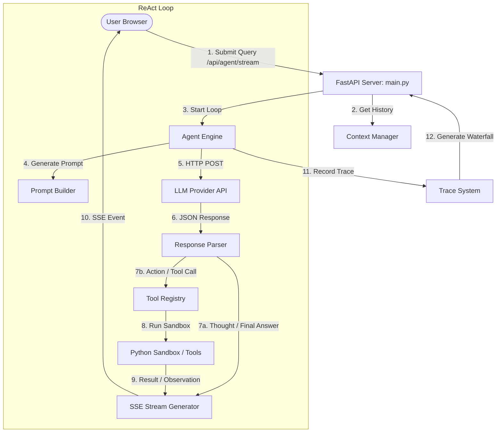

# System Architecture & Technical Design

This document details the internal design, component specifications, and data flow of the **AI Agent Platform & Sandbox**. The system is built from scratch with zero heavy frameworks, prioritizing high observability, secure tool execution, and low latency.

---

## 1. High-Level Architecture

The platform follows a decoupled client-server architecture:
- **Frontend (Client)**: A vanilla JS single-page application that renders the SSE stream, trace timeline, waterfall diagrams, and configuration managers.
- **Backend (Server)**: A FastAPI orchestrator managing the stateful context, execution trace system, tool adapters, and the custom ReAct agent loop.



---

## 2. Component Specifications

### 2.1 API Gateway & Server (`backend/main.py`)
The web layer utilizes **FastAPI** to support both asynchronous standard REST requests and Server-Sent Events (SSE) streaming.
- **Static Mounting**: Serves the vanilla frontend static assets by mounting the `/static` route to the `frontend/` directory.
- **Server-Sent Events (SSE)**: The `/api/agent/stream` endpoint streams chunked JSON updates using a `StreamingResponse` event generator. To improve frontend visualization pacing, a `0.3s` sleep throttle is introduced during the step generator sequence.
- **CORS Configuration**: Open CORS middleware allows cross-origin tool adapters and third-party integrations to connect seamlessly.

---

### 2.2 ReAct Engine (`backend/agent_engine.py`)
Unlike agent libraries that hide prompt details, the custom ReAct (Reason + Act) loop is built explicitly using native API schemas:
- **OpenAI Tool Formatting**: Translates registered parameter types (e.g. `int`, `list`, `dict`) into strict JSON Schema draft-07 formats required by the LLM function calls.
- **Claude & Gemini Translators**:
  - **Claude**: Adapts system prompt blocks and merges consecutive user/assistant dialogue sequences to comply with Anthropic's strict alternating-role schema rules.
  - **Gemini**: Supports native thought signatures (`thoughtSignature`/`thought_signature`) extracted from Google's OpenAI-compatible model outputs, bypasses validators with a safety fallback, and tracks reasoning latency.
- **Free Provider (Pollinations)**: Implements custom regex parsing to extract tool invocations from standard text generations. To respect free-tier API limitations, the engine throttles successive requests in Pollinations mode by `1.5` seconds.

---

### 2.3 Context Manager (`backend/context_manager.py`)
Handles token budgeting and memory persistence in-memory:
- **Token Estimation**: Uses a fast word-count heuristics algorithm (`sum(words) * 1.3`) to estimate tokens without importing heavy tokenizer binaries.
- **Sliding Window Protocol**:
  - Monitors conversation history size.
  - If a conversation exceeds the default threshold (`max_tokens=4096`), it triggers `_trim_context`.
  - Pops the oldest user-agent exchanges from memory.
  - Appends a brief text summary to the conversation metadata to maintain history awareness for the LLM.

---

### 2.4 Trace & Observability System (`backend/trace.py`)
Maintains full execution observability:
- **Timing Waterfall**: On each step (Thought, Action, Observation, Final Answer, Error), a trace span is created containing the timestamp, latency in milliseconds, and token counters.
- **Waterfall Spans**: Calculates a timing span for the UI by determining relative start time offsets (`(timestamp - start_time) * 1000`) and duration:
```json
{
  "id": "trace-uuid-1",
  "label": "action: Using tool: execute_code(...)",
  "type": "action",
  "start_ms": 250.5,
  "duration_ms": 1120.3,
  "parent": null
}
```

---

### 2.5 Security Sandbox (`backend/tools/code_sandbox.py`)
To allow the agent to write and execute code safely on the server, a multi-layered security layer is implemented:
- **Code Blocklist**: Rejects requests containing blocked strings (e.g. `import os`, `import sys`, `subprocess`, `eval`, `open`, `__builtins__`) to prevent file/network access or command execution.
- **Restricted Namespace**: Evaluates user code under a custom `__builtins__` dict containing only safe operations (e.g. `abs`, `len`, `print`, `dict`).
- **Module Allowlist**: Makes specific standard packages available (`math`, `random`, `collections`, `itertools`, `re`, `json`, `datetime`, `hashlib`, etc.).
- **Execution Timeouts**: Applies POSIX `signal.SIGALRM` timeouts. The sandbox triggers a `SandboxTimeout` exception if a execution exceeds `5 seconds`, stopping CPU-hogging infinite loops.

---

## 3. Data Flow Models

### SSE Streaming Event Payload
Every event emitted during agent loop execution follows this JSON schema:

```json
event: step
data: {
  "conversation_id": "8e367878-1a55-46f0-b88a-36fb190f845d",
  "step": {
    "id": "e932ba11",
    "step_number": 2,
    "step_type": "action",
    "content": "Using tool: get_crypto_price({\"coin_id\": \"bitcoin\"})",
    "tool_call": {
      "tool_name": "get_crypto_price",
      "arguments": {
        "coin_id": "bitcoin"
      }
    },
    "tool_result": null,
    "latency_ms": 420.5,
    "tokens_used": 15,
    "timestamp": "2026-05-29T17:00:00.000Z"
  }
}
```

### Trace Waterfall Payload
Retrieved via `GET /api/traces/{conversation_id}`:

```json
{
  "traces": [ ... ],
  "waterfall": {
    "spans": [
      {
        "id": "e932ba11",
        "label": "thought: Calculating crypto valuation",
        "type": "thought",
        "start_ms": 0.0,
        "duration_ms": 520.1,
        "parent": null
      },
      {
        "id": "c108ba3f",
        "label": "action: Using tool: calculate(...)",
        "type": "action",
        "start_ms": 525.0,
        "duration_ms": 150.3,
        "parent": "e932ba11"
      }
    ],
    "total_ms": 670.4
  },
  "summary": {
    "total_steps": 2,
    "total_latency_ms": 670.4,
    "total_tokens": 42,
    "step_breakdown": {
      "thought": 1,
      "action": 1
    }
  }
}
```

---

## 4. Portability & Running Contexts

The app's files can run anywhere. The `run.sh` / `run.bat` scripts create an isolated environment automatically.

- **Venv Creation**: Creates a local Python environment using standard `venv`. If standard libraries are crippled or missing the pip seeder (a common issue in minimal Ubuntu images), it falls back to installing and executing `virtualenv` under the user's home directory (`$HOME/.local/bin/virtualenv`).
- **Compose Mounts**: The `docker-compose.yml` mounts the code directories into the container. This bypasses the need to rebuild the container when making updates to backend functions or frontend scripts.
